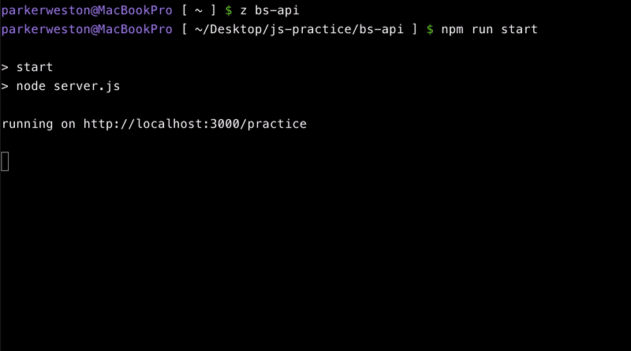

# tmux-spoony



Small tmux copy-mode helpers for grabbing useful terminal text without replacing tmux copy mode.

Spoony adds one-key selectors for URLs, paths, shell commands, and whole lines. You still navigate with normal tmux copy-mode keys.

## Usage

Enter copy mode:

```text
prefix [
```

Move to a target line with normal tmux copy-mode navigation, then press:

```text
u  select URL on the cursor line
p  select path on the cursor line
m  select command after the prompt
x  select the whole line
o  open the selected text
y  yank the selected text
```

Example:

```text
running on http://localhost:3000/practice
```

Move to that line, press `u`, then press `o`.

## Install

### TPM

Add Spoony to your `~/.tmux.conf` plugin list:

```tmux
set -g @plugin 'parwest/tmux-spoony'
```

Make sure the plugin line appears before TPM is initialized:

```tmux
run '~/.tmux/plugins/tpm/tpm'
```

Reload tmux config:

```sh
tmux source-file ~/.tmux.conf
```

Install the plugin with TPM:

```text
prefix + I
```

Or run TPM's installer directly:

```sh
~/.tmux/plugins/tpm/bin/install_plugins
```

Reload tmux once more after install:

```sh
tmux source-file ~/.tmux.conf
```

### Local Checkout

For local testing without TPM, run the plugin file directly:

```sh
tmux run-shell '/path/to/tmux-spoony/tmux-spoony.tmux'
```

To load a local checkout from `~/.tmux.conf`:

```tmux
run-shell '/path/to/tmux-spoony/tmux-spoony.tmux'
```

## Key Bindings

Spoony works without configuration. To override defaults, set options before loading the plugin:

```tmux
set -g @spoony-url-key 'u'
set -g @spoony-path-key 'p'
set -g @spoony-command-key 'm'
set -g @spoony-line-key 'x'
set -g @spoony-open-key 'o'
```

Any key can be disabled with `off`:

```tmux
set -g @spoony-open-key 'off'
```

## Prompt Matching

The command selector uses this default prompt regex:

```tmux
set -g @spoony-command-prompt-regex '^.+[$#>] +'
```

It matches common prompts ending in `$ `, `# `, or `> `, and avoids mistaking lines like npm's `> start` output for a shell prompt. If your prompt is unusual, set a more specific regex before loading Spoony.

## Requirements

- tmux with `copy-mode-vi` key tables
- Bash
- macOS `open` if you use Spoony's default `o` opener

Development/testing system:

- macOS
- tmux `3.6a`
- GNU Bash `5.3.9`
- `copy-mode-vi`
